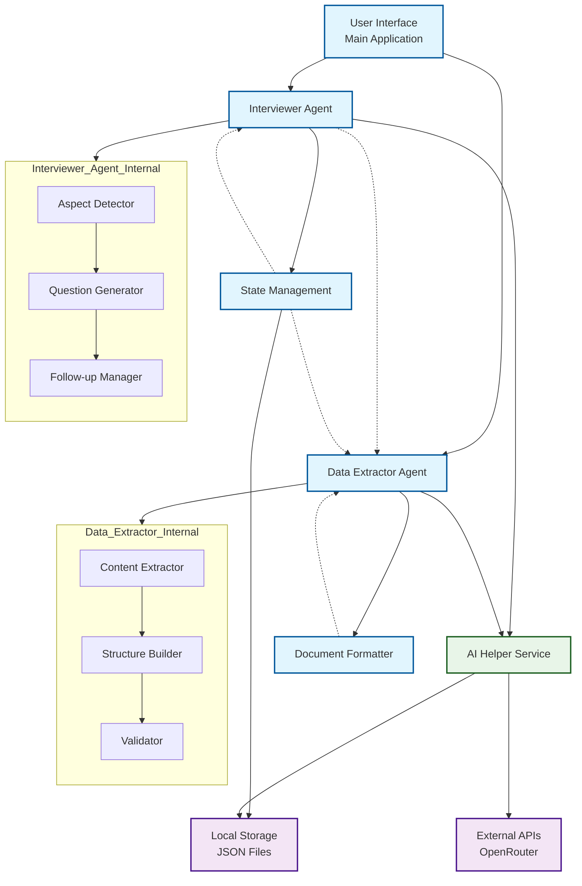

# Process Documentation Interview System

<a name="readme-top"></a>

<!-- PROJECT SHIELDS -->
[![Contributors][contributors-shield]][contributors-url]
[![Forks][forks-shield]][forks-url]
[![Stargazers][stars-shield]][stars-url]
[![Issues][issues-shield]][issues-url]
[![MIT License][license-shield]][license-url]

<!-- PROJECT LOGO -->
<br />
<div align="center">
  <h3 align="center">Process Documentation Interview System</h3>
  <p align="center">
    AI-powered system for conducting structured interviews and generating comprehensive process documentation
    <br />
  </p>
</div>

<!-- TABLE OF CONTENTS -->
<details>
  <summary><strong>📚 Table of Contents</strong></summary>
  
  - [About the Project](#about-the-project-)
  - [Architecture](#architecture-)
  - [System Schema](#system-schema-)
  - [Risk Considerations](#risk-considerations-)
  - [Getting Started](#getting-started-)
  - [Features](#features-)
  - [Future Upgrades](#future-upgrades-)
  - [Contributing](#contributing-)
  - [License](#license-)
  - [Contact](#contact-)

</details>

<!-- ABOUT THE PROJECT -->
## About The Project 🎨

The Process Documentation Interview System is an AI-powered application that conducts structured interviews to extract detailed information about processes and automatically generates comprehensive, standardized documentation. The system uses advanced language models to ask contextually relevant questions and transform conversation transcripts into professional process documentation that others can follow consistently.

### Built With 

* [![Python][python-shield]][python-url]
* [![DeepSeek][deepseek-shield]][deepseek-url]
* [![OpenRouter][openrouter-shield]][openrouter-url]
* [![Ollama][ollama-shield]][ollama-url]

<p align="right"><a href="#readme-top">Back to Top</a></p>

<!-- ARCHITECTURE -->
## Architecture 🏗️

The system follows a modular agent-based architecture with three main components:

### Core Components

1. **Interviewer Agent**
   - Conducts structured interviews using aspect-based questioning
   - Determines relevant aspects based on process type
   - Generates context-aware questions using AI
   - Handles follow-up questions for incomplete answers

2. **State Management System**
   - Tracks conversation history and covered aspects
   - Determines relevant aspects for each process type
   - Manages interview progression and completion criteria
   - Supports save/load functionality for interrupted interviews

3. **Data Extractor Agent**
   - Transforms conversation transcripts into structured documentation
   - Creates comprehensive process documents with standardized sections
   - Implements fallback mechanisms for AI service failures
   - Ensures documentation quality through validation checks

### AI Integration Layers

1. **Primary AI Service** (DeepSeek R1 via OpenRouter)
   - Handles intelligent question generation
   - Processes natural language conversations
   - Extracts and structures information from dialogues

2. **Fallback AI Service** (Local Ollama)
   - Provides redundancy for API failures
   - Ensures system functionality without internet connectivity
   - Supports offline operation with local models

<p align="right"><a href="#readme-top">Back to Top</a></p>

<!-- SYSTEM SCHEMA -->
## System Schema 🔧


text

### Data Flow

1. **Initialization**: User provides process topic → System determines relevant aspects
2. **Interview Phase**: AI generates questions → User provides answers → System tracks coverage
3. **Extraction Phase**: Conversation processed → Documentation generated → Output formatted
4. **Persistence**: Interview state saved → Final document exported

### Aspect Coverage System

The system intelligently determines which aspects are relevant for different process types:

- **Physical Processes** (baking, manufacturing): Materials, Tools, Steps, Exceptions
- **Digital Processes** (coding, design): Tools, Steps, Success Criteria
- **Collaborative Processes** (team workflows): Actors, Roles, Communication
- **Universal Aspects**: Purpose, Steps, Success Criteria

<p align="right"><a href="#readme-top">Back to Top</a></p>

<!-- RISK CONSIDERATIONS -->
## Risk Considerations ⚠️

### Technical Risks

1. **API Dependency**
   - **Risk**: System functionality dependent on external AI services
   - **Mitigation**: Built-in fallback to local Ollama models
   - **Contingency**: Graceful degradation when APIs are unavailable

2. **Data Quality**
   - **Risk**: AI hallucinations or incorrect information extraction
   - **Mitigation**: Strict validation against conversation content
   - **Contingency**: Manual review process for critical documentation

3. **Conversation Tracking**
   - **Risk**: Aspect coverage detection failures
   - **Mitigation**: Multiple detection methods with fallback questions
   - **Contingency**: Manual aspect selection option

### Operational Risks

1. **User Experience**
   - **Risk**: Repetitive or irrelevant questioning
   - **Mitigation**: Context-aware question generation with aspect tracking
   - **Contingency**: Conversation history analysis to prevent repetition

2. **Documentation Quality**
   - **Risk**: Incomplete or inconsistent process documentation
   - **Mitigation**: Structured templates with validation rules
   - **Contingency**: Editable output format for manual refinement

3. **Privacy Considerations**
   - **Risk**: Sensitive process information exposure
   - **Mitigation**: Local processing option with Ollama fallback
   - **Contingency**: Data anonymization features for sensitive content

### Security Considerations

1. **API Key Management**
   - **Risk**: Exposure of API credentials
   - **Mitigation**: Environment variable configuration
   - **Contingency**: Key rotation and access monitoring

2. **Data Persistence**
   - **Risk**: Unencrypted local storage of conversations
   - **Mitigation**: Optional encryption for sensitive processes
   - **Contingency**: Secure deletion options

<p align="right"><a href="#readme-top">Back to Top</a></p>

<!-- GETTING STARTED -->
## Getting Started 🧩

To get a local copy up and running, follow these steps:

### Requirements
- **Python 3.8+**
- **Ollama** (for local fallback mode)
- **DeepSeek API Key** (for enhanced functionality)

### Installation

1. **Clone the repository**
   ```bash
   git clone https://github.com/your-username/process-interview-system
   cd process-interview-system
Install dependencies

bash
pip install -r requirements.txt
Set up Ollama (optional)

bash
# Install Ollama from https://ollama.ai/
ollama pull llama3:8b-instruct
Configure API key

bash
# Set environment variable
export DEEPSEEK_API_KEY="your-api-key-here"
Run the application

bash
python main.py
<p align="right"><a href="#readme-top">Back to Top</a></p><!-- FEATURES -->
Features 🛠
Intelligent Interviewing

Aspect-based question generation

Context-aware follow-up questions

Adaptive aspect relevance detection

Comprehensive Documentation

Standardized process document structure

Multiple output formats (Markdown, JSON)

Customizable template system

Robust Architecture

Dual AI service support (Cloud + Local)

State persistence and recovery

Graceful degradation during service outages

User-Friendly Interface

Conversational interview style

Progress tracking and completion indicators

Export and sharing capabilities

<p align="right"><a href="#readme-top">Back to Top</a></p><!-- FUTURE UPGRADES -->
Future Upgrades 🚀
Multi-language support for international teams

Voice-based interview capabilities

Real-time collaboration features

Advanced document customization options

Integration with popular documentation platforms

Process simulation and validation tools

Analytics and process improvement recommendations

<p align="right"><a href="#readme-top">Back to Top</a></p><!-- CONTRIBUTING -->
Contributing 🤝
Contributions are what make the open source community such a great learning environment! If you have ideas for improvements, feel free to fork and submit a pull request.

Steps to contribute:

Fork the repo

Create a feature branch (git checkout -b feature/my-feature)

Commit your changes (git commit -m "Add my feature")

Push to the branch (git push origin feature/my-feature)

Open a pull request

<p align="right"><a href="#readme-top">Back to Top</a></p><!-- LICENSE -->
License 📄
Distributed under the MIT License. See LICENSE for more info.

<p align="right"><a href="#readme-top">Back to Top</a></p><!-- CONTACT -->
Contact ☎️
Project Link: https://github.com/your-username/process-interview-system

<p align="right"><a href="#readme-top">Back to Top</a></p><!-- MARKDOWN LINKS & IMAGES -->[contributors-shield]: https://img.shields.io/github/contributors/your-username/process-interview-system.svg?style=for-the-badge
[contributors-url]: https://github.com/your-username/process-interview-system/graphs/contributors
[forks-shield]: https://img.shields.io/github/forks/your-username/process-interview-system.svg?style=for-the-badge
[forks-url]: https://github.com/your-username/process-interview-system/network/members
[stars-shield]: https://img.shields.io/github/stars/your-username/process-interview-system.svg?style=for-the-badge
[stars-url]: https://github.com/your-username/process-interview-system/stargazers
[issues-shield]: https://img.shields.io/github/issues/your-username/process-interview-system.svg?style=for-the-badge
[issues-url]: https://github.com/your-username/process-interview-system/issues
[license-shield]: https://img.shields.io/github/license/your-username/process-interview-system.svg?style=for-the-badge
[license-url]: https://github.com/your-username/process-interview-system/blob/master/LICENSE.txt
[python-shield]: https://img.shields.io/badge/Python-3.8%2B-blue?style=for-the-badge&logo=python
[python-url]: https://www.python.org/
[deepseek-shield]: https://img.shields.io/badge/DeepSeek-R1-black?style=for-the-badge&logo=ai
[deepseek-url]: https://www.deepseek.com/
[openrouter-shield]: https://img.shields.io/badge/OpenRouter-API-orange?style=for-the-badge
[openrouter-url]: https://openrouter.ai/
[ollama-shield]: https://img.shields.io/badge/Ollama-Local%20AI-purple?style=for-the-badge
[ollama-url]: https://ollama.ai/
